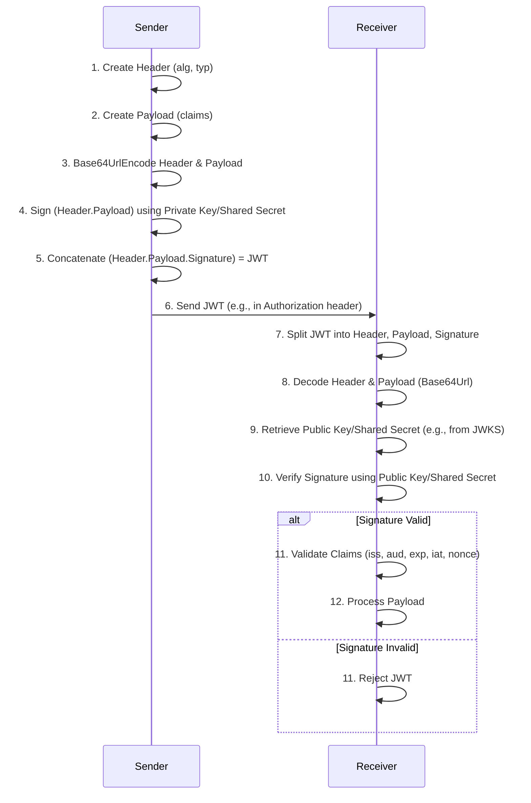
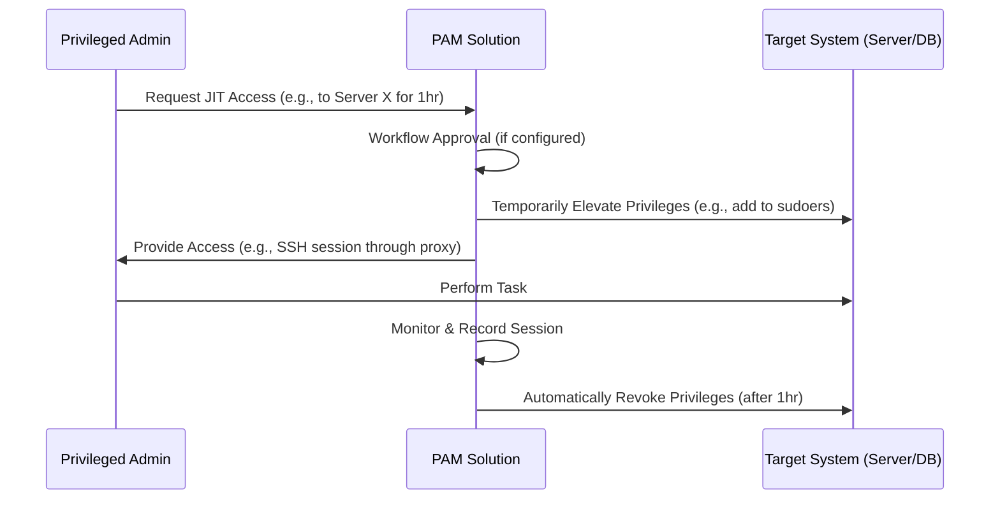

This document provides a concise, overview of critical security engineering domains, focusing on architectural principles, implementation strategies, and governance for secure systems.

## Web Application & API Security Fundamentals

Secure web application and API design is paramount, integrating security throughout the software development lifecycle to address the significant attack surface.

### Architectural Patterns & Security Principles

Modern web application architectures present distinct security challenges, necessitating adherence to foundational principles ([NIST SP 800-204A: Security Strategies for Microservices-based Applications](https://nvlpubs.nist.gov/nistpubs/SpecialPublications/NIST.SP.800-204A.pdf)):


* **Traditional Multi-Tier**: Clear tier separation, server-side session management.
* **Single Page Applications (SPAs)**: Client-side security, API security, token-based authentication, [CORS](https://developer.mozilla.org/en-US/docs/Web/HTTP/CORS).
* **Microservices**: Service-to-service authentication, API Gateway security, distributed session management, often leveraging service meshes (e.g., [Istio](https://istio.io/)).
* **Serverless**: Granular function permissions, secure event source integration.

**Core Security Principles**:


1. **Defense in Depth**: Multiple, independent layers of security controls for redundant protection.
2. **Least Privilege**: Granting minimum necessary access rights.
3. **Secure by Default**: Designing systems with secure default configurations.
4. **Fail Secure**: Systems default to a secure state upon failure.
5. **Complete Mediation**: Consistent security checks for every request.

Threat modeling (e.g., [STRIDE](https://learn.microsoft.com/en-us/previous-versions/commerce/security-guidance/dn751011(v=msdn.10)?redirectedfrom=MSDN), [DREAD](https://www.owasp.org/index.php/DREAD_Model)) is crucial for identifying risks across trust boundaries.


### OWASP Top 10 Vulnerabilities & Mitigations

The [OWASP Top 10 2021](https://owasp.org/Top10/) outlines critical web application security risks. The average cost of a data breach is estimated at $4.24 million (IBM Cost of a Data Breach Report, 2021).


* **A01: Broken Access Control**: Failures in enforcing user permissions.
    * **Mitigation**: Deny-by-default, server-side enforcement ([RBAC](https://csrc.nist.gov/projects/role-based-access-control)/[ABAC](https://nvlpubs.nist.gov/nistpubs/SpecialPublications/NIST.SP.800-162.pdf)).
* **A02: Cryptographic Failures**: Inadequate protection of sensitive data.
    * **Mitigation**: [TLS 1.2/1.3](https://datatracker.ietf.org/doc/html/rfc8446), strong cipher suites, [AES-256](https://nvlpubs.nist.gov/nistpubs/FIPS/NIST.FIPS.197.pdf), secure key management.
* **A03: Injection**: Untrusted data interpreted as commands (SQL, OS).
    * **Mitigation**: Prepared statements, parameterized queries, input validation, context-aware output encoding.
    * **Example (Java Prepared Statement)**: 
```java
PreparedStatement ps = conn.prepareStatement("SELECT * FROM users WHERE username = ?");
ps.setString(1, username);
```

* **A04: Insecure Design**: Security flaws in architecture/design.
    * **Mitigation**: Integrated threat modeling, secure design patterns.
* **A05: Security Misconfiguration**: Improperly configured security controls.
    * **Mitigation**: [CIS Benchmarks](https://www.cisecurity.org/cis-benchmarks/), automated deployment, immutable infrastructure.
* **A06: Vulnerable & Outdated Components**: Using components with known vulnerabilities.
    * **Mitigation**: [SCA](https://owasp.org/www-project-software-component-analysis/), dependency scanning (e.g., [OWASP Dependency-Check](https://owasp.org/www-project-dependency-check/)).
* **A07: Identification & Authentication Failures**: Flaws in identity verification.
    * **Mitigation**: Strong password policies (Argon2id/bcrypt), [MFA](https://nvlpubs.nist.gov/nistpubs/SpecialPublications/NIST.SP.800-63b.pdf), secure session management.
* **A08: Software & Data Integrity Failures**: Violations of code/data integrity.
    * **Mitigation**: Digital signatures, secure CI/CD pipelines, deserialization controls.
* **A09: Security Logging & Monitoring Failures**: Inadequate detection/response.
    * **Mitigation**: Structured logging, centralized [SIEM](https://www.gartner.com/en/information-technology/glossary/security-information-and-event-management-siem), real-time monitoring.
* **A10: Server-Side Request Forgery (SSRF)**: Server-side requests controlled by attacker.
    * **Mitigation**: Strict URL validation (allowlisting), egress filtering.


### Defense in Depth & Secure Configuration Management

Defense in depth layers security controls ([NIST SP 800-95: Guide to Secure Web Services](https://nvlpubs.nist.gov/nistpubs/Legacy/SP/nistspecialpublication800-95.pdf)):


* **Network Layer**: Firewalls, DDoS protection, network segmentation ([ZTNA](https://www.cloudflare.com/learning/access-control/what-is-zero-trust-network-access/)).
* **Host Layer**: OS hardening ([CIS Benchmarks](https://www.cisecurity.org/cis-benchmarks/)), patching, container security.
* **Application Layer**: Input validation, [WAFs](https://www.cloudflare.com/learning/security/what-is-a-waf/), [RASP](https://www.gartner.com/en/information-technology/glossary/runtime-application-self-protection-rasp), API Security Gateways.
* **Data Layer**: Encryption at rest/in transit, data masking, granular access controls.

**Secure Configuration Management** ([NIST SP 800-128: Guide for Security-Focused Configuration Management of Information Systems](https://nvlpubs.nist.gov/nistpubs/SpecialPublications/NIST.SP.800-128.pdf)):


* **Security Baselines**: Documented hardened configurations.
* **Infrastructure as Code (IaC) Security**: Integrating security into IaC workflows (e.g., [Checkov](https://www.checkov.io/), [Open Policy Agent](https://www.openpolicyagent.org/)).
* **Security Headers & TLS**: Proper HTTP security headers (e.g., Content-Security-Policy, Strict-Transport-Security [HSTS]) and robust TLS configurations.
* **Configuration Drift Management**: Preventing and detecting deviations from baselines.


## Authentication & Authorization Mechanisms

Authentication verifies identity; authorization grants access based on privileges.

### Authentication Fundamentals & MFA

Authentication relies on factors: Something You Know (passwords), Something You Have (tokens), Something You Are (biometrics). [NIST SP 800-63B: Digital Identity Guidelines](https://nvlpubs.nist.gov/nistpubs/SpecialPublications/NIST.SP.800-63b.pdf) defines Authentication Assurance Levels (AALs).

**Password Security**: Use strong, salted, adaptive hash functions (Argon2id, bcrypt) for storage ([OWASP Password Storage Cheat Sheet](https://cheatsheetseries.owasp.org/cheatsheets/Password_Storage_Cheat_Sheet.html)). Focus on length (12+ chars) and breach checking.

**Multi-Factor Authentication (MFA)**: Requires multiple authentication factors.


* **Methods**: Software OTP ([TOTP/HOTP per RFC 6238](https://tools.ietf.org/html/rfc6238)), Hardware OTP, Push Notifications, [FIDO/WebAuthn](https://www.w3.org/TR/webauthn-2/) (strongest phishing resistance).
* **Strategies**: Risk-based/adaptive MFA, secure enrollment/recovery.


### OAuth 2.0 & OpenID Connect (OIDC)


* **OAuth 2.0 ([RFC 6749](https://tools.ietf.org/html/rfc6749))**: An authorization framework for delegated access.
    * **Use Case**: User grants a client application limited access to their resources on a resource server (e.g., a photo app accessing Google Photos, a Trading app connecting to the user's Bank Account).
    * **Grant Types**: OAuth 2.0 defines several grant types, each optimized for different client types and use cases.
        * **Authorization Code Grant ([RFC 6749, Section 4.1](https://tools.ietf.org/html/rfc6749#section-4.1))**: The most secure and recommended flow for confidential clients (server-side web applications) and public clients (SPAs, mobile apps).
            * **PKCE (Proof Key for Code Exchange - [RFC 7636](https://tools.ietf.org/html/rfc7636))**: **Mandatory** for public clients. The client generates a code_verifier (cryptographically random string) and a code_challenge (a hash of the verifier). The code_challenge is sent in the initial authorization request. Upon receiving the authorization code, the client sends it back to the Authorization Server's token endpoint along with the code_verifier. The AS computes the code_challenge again and verifies it matches, ensuring the same client that initiated the flow is completing it, preventing authorization code interception attacks.
        * **Refresh Token Grant ([RFC 6749, Section 1.5 & 6](https://tools.ietf.org/html/rfc6749#section-1.5))**: Used by clients to obtain new access tokens without re-authenticating the user, typically after the initial access token expires. Refresh tokens are long-lived and must be stored securely. They can be single-use or reusable, and should be sender-constrained (e.g., bound to a specific client or device) to prevent token leakage.
        * **Implicit Grant ([RFC 6749, Section 4.2](https://tools.ietf.org/html/rfc6749#section-4.2))**: **Deprecated and SHOULD NOT be used.** Tokens are returned directly in the URI fragment, making them vulnerable to leakage via browser history, referrer headers, and malicious scripts. It lacks refresh token capability.
        * **Client Credentials Grant ([RFC 6749, Section 4.4](https://tools.ietf.org/html/rfc6749#section-4.4))**: Used by confidential clients to obtain an access token on their own behalf, without a user's involvement. The access token obtained via this grant **MUST NOT** be used to access user-specific data; it is for accessing resources owned by the client itself or for machine-to-machine communication.
    * **Security**: TLS is mandatory for all communication. Exact redirect URIs must be registered to prevent open redirect vulnerabilities. The state parameter must be used to prevent [CSRF](https://owasp.org/www-community/attacks/csrf) attacks. Access token validation at the resource server is critical ([OAuth 2.0 Security Best Current Practice](https://datatracker.ietf.org/doc/html/draft-ietf-oauth-security-topics)).


* **OpenID Connect (OIDC) ([OpenID Connect Core 1.0](https://openid.net/specs/openid-connect-core-1_0.html))**: Identity layer on OAuth 2.0 for user authentication.
    * **Use Case**: Client application needs to verify the user's identity (e.g., "Login with Google" on a website).
    * **ID Token**: A [JWT ([RFC 7519](https://tools.ietf.org/html/rfc7519))](https://tools.ietf.org/html/rfc7519) containing verifiable claims about the authenticated user.
    * **Validation**: Crucial steps include signature verification (using [JWK Set URL - RFC 7517](https://tools.ietf.org/html/rfc7517)), and validation of iss (issuer), aud (audience), exp (expiration), iat (issued at), and nonce (to mitigate replay attacks) claims. The nonce claim links the ID Token to the authorization request to prevent replay attacks. The acr (Authentication Context Class Reference) and amr (Authentication Methods References) claims provide information about the authentication performed (e.g., password, OTP, FIDO).
    * **Example JWT Payload**: 
```json
{
  "iss": "https://auth.example.com",
  "sub": "user123",
  "aud": "my-app-client-id",
  "exp": 1678886400,
  "iat": 1678882800,
  "auth_time": 1678882700,
  "acr": "http://schemas.openid.net/pape/policies/2007/06/multi-factor",
  "amr": ["pwd", "otp"],
  "name": "Jane Doe",
  "email": "jane.doe@example.com",
  "roles": ["user", "editor"]
}
```

    * **Private Key JWT ([RFC 7523](https://tools.ietf.org/html/rfc7523))**: Client authenticates to the Authorization Server using a signed JWT instead of a shared secret, enhancing security. This is particularly useful for confidential clients that cannot securely store a client secret.


### SAML 2.0 for Enterprise SSO


* **SAML 2.0 ([OASIS SAML V2.0 Technical Overview](http://docs.oasis-open.org/security/saml/Post2.0/sstc-saml-tech-overview-2.0.html))**: XML-based standard for exchanging authentication/authorization data between an Identity Provider (IdP) and a Service Provider (SP).
    * **Use Case**: Enterprise Single Sign-On (SSO) where employees access multiple internal applications or cloud services (e.g., logging into Salesforce using corporate credentials).
    * **Flow**: SP redirects to IdP, IdP authenticates user and returns signed SAML Response (assertion) to SP. SP validates assertion and establishes a session.
    * **Technical Insight**: The SAML Response contains an &lt;Assertion> element, which includes the authenticated user's identity (e.g., via &lt;NameID>) and potentially attributes (&lt;AttributeStatement>). The entire response or just the assertion is digitally signed by the IdP using XML Digital Signatures ([XML-DSig](https://www.w3.org/TR/xmldsig-core/)). The SP must validate this signature against the IdP's public key, often obtained from the IdP's metadata XML.
    * **Security**: Mandatory digital signature validation of the entire SAML Response and Assertion. Validation includes AudienceRestriction (ensuring the assertion is for the correct SP), NotBefore/NotOnOrAfter timestamps (for validity period), and InResponseTo (linking response to original request for replay protection). TLS is mandatory for all communication. Assertion encryption (using [XML Encryption](https://www.w3.org/TR/xmlenc-core/)) is optional but recommended for sensitive attributes.


### Mutual TLS (mTLS) Authentication


* **mTLS**: Strong, certificate-based mutual authentication where both client and server present and validate certificates.
    * **Use Cases**: Device authentication (IoT), service-to-service authentication (microservices, service mesh), high-assurance client authentication in banking/finance.
    * **Technical Insight**:
        * **Certificate Exchange**: During the TLS handshake, after the server presents its certificate, it sends a CertificateRequest message to the client. The client responds with its X.509 certificate and a CertificateVerify message, which is a digital signature over a hash of the handshake messages, proving possession of the private key corresponding to the presented certificate.
        * **Certificate Validation**: Both client and server perform certificate path validation, checking the certificate chain up to a trusted Root Certificate Authority (CA), verifying revocation status (via CRLs or OCSP), and ensuring the certificate's validity period.
        * **Authentication, Authorization, Accounting (AAA)**:
            * **Authentication**: The client's identity is cryptographically verified by the server based on its certificate. The Subject DN or Subject Alternative Name (SAN) from the client certificate is often used as the client's principal.
            * **Authorization**: Once authenticated, the client's identity (from the certificate) can be mapped to roles or attributes for fine-grained access control decisions (e.g., an API Gateway might authorize requests based on the client certificate's organizational unit).
            * **Accounting**: mTLS connections can be logged with details of the client certificate (e.g., serial number, subject DN) for auditing and non-repudiation.
    * **Considerations**: Robust [PKI (Public Key Infrastructure)](https://csrc.nist.gov/glossary/term/public_key_infrastructure) for certificate issuance, distribution, revocation (via CRLs or OCSP), and renewal is essential. This can add operational complexity compared to token-based authentication.


### JSON Web Tokens (JWT) - JWS and JWE

JWTs are compact, URL-safe means of representing claims between two parties. They can be either JWS (JSON Web Signature) or JWE (JSON Web Encryption).


* **JSON Web Signature (JWS) ([RFC 7515](https://tools.ietf.org/html/rfc7515))**: Represents content secured with a digital signature or a Message Authentication Code (MAC) using JSON-based data structures.
    * **Structure**: BASE64URL(UTF8(JWS Protected Header)) || '.' || BASE64URL(JWS Payload) || '.' || BASE64URL(JWS Signature)
    * **Signing & Verification**:
        * **Shared Key (HMAC)**: A symmetric key is used for both signing and verification. The alg header parameter indicates the HMAC algorithm (e.g., HS256).
        * **Public RSA Key**: An asymmetric key pair is used. The sender signs with their private RSA key, and the receiver verifies with the corresponding public RSA key. The alg header parameter indicates the RSA algorithm (e.g., RS256).
        * **X.509 Certificate**: The public key for verification can be conveyed via an X.509 certificate. The x5c (X.509 Certificate Chain) or x5t (X.509 Certificate Thumbprint) header parameters can be used to reference the certificate.
    * **JWKS (JSON Web Key Set) ([RFC 7517](https://tools.ietf.org/html/rfc7517))**: A JSON object that represents a set of JSON Web Keys (JWKs). It's commonly used by providers to publish their public keys for Token signature verification.
        * **Example JWKS (RSA Public Key)**: 
```json
{
  "keys": [
    {
      "kty": "RSA",
      "kid": "unique-key-id-1",
      "use": "sig",
      "alg": "RS256",
      "n": "...", // RSA modulus, Base64urlUInt-encoded
      "e": "..."  // RSA public exponent, Base64urlUInt-encoded
    }
  ]
}
```

        * **Example JWKS (X.509 Certificate Reference)**: 
```json
{
  "keys": [
    {
      "kty": "RSA",
      "kid": "cert-key-id-2",
      "use": "sig",
      "alg": "RS256",
      "x5c": [
        "MIIC+DCCAeCgAwIBAgI...", // Base64-encoded X.509 certificate
        "MIIC+DCCAeCgAwIBAgI..."  // Optional: intermediate CA certs
      ]
    }
  ]
}
```

* **JSON Web Encryption (JWE) ([RFC 7516](https://tools.ietf.org/html/rfc7516))**: Represents content encrypted with a digital encryption method using JSON-based data structures.
    * **Structure**: BASE64URL(UTF8(JWE Protected Header)) || '.' || BASE64URL(JWE Encrypted Key) || '.' || BASE64URL(JWE Initialization Vector) || '.' || BASE64URL(JWE Ciphertext) || '.' || BASE64URL(JWE Authentication Tag)
    * **Inner Signing then Encrypting**: To ensure both integrity (signature) and confidentiality (encryption) of sensitive data, a common pattern is to sign the payload first (creating a JWS) and then encrypt the resulting JWS (creating a JWE). This is known as "nested JWTs".
        * **Process**:
            1. Create a JWS with the claims.
            2. Take the compact serialization of the JWS as the plaintext for JWE.
            3. Encrypt the JWS to create a JWE.
        * **Benefit**: This ensures that even if the encryption is somehow broken, the integrity of the original signed data is still protected by the inner signature.
    * **Example (JWE Header)**: 
```json
{
  "alg": "RSA-OAEP", // Algorithm for encrypting the Content Encryption Key (CEK)
  "enc": "A128CBC-HS256", // Algorithm for encrypting the plaintext
  "kid": "encryption-key-id"
}
```

* **JWT Process (Signing and Verification)**: 



## Access Control Implementation

Access control enforces authorization decisions, ensuring users only access authorized resources.

### Role-Based Access Control (RBAC)


* **RBAC ([NIST RBAC](https://csrc.nist.gov/projects/role-based-access-control))**: Permissions assigned based on job functions (roles).
    * **Core Concepts**: Users, Roles, Permissions.
    * **Models**: Core, Hierarchical, Constrained (with Separation of Duties - SoD).
    * **Practical Insight**: Many frameworks (Spring Security @PreAuthorize("hasRole('ADMIN')"), ASP.NET Core Identity Policy-Based Authorization, [CASL](https://casl.js.org/) for Node.js) provide RBAC support.
    * **Example Database Schema**: users, roles, permissions, user_roles, role_permissions tables.


### Attribute-Based Access Control (ABAC)


* **ABAC ([NIST SP 800-162](https://nvlpubs.nist.gov/nistpubs/SpecialPublications/NIST.SP.800-162.pdf))**: Fine-grained control by evaluating rules combining attributes of subject, resource, action, and environment.
    * **Standard**: [XACML (eXtensible Access Control Markup Language)](http://docs.oasis-open.org/xacml/3.0/xacml-3.0-core-spec-os-en.html).
    * **Practical Insight**: Offers greater flexibility for dynamic contexts but is more complex. Cloud providers (AWS IAM policy conditions) offer ABAC.
    * **Example (Simplified XACML Policy)**: 
```xml
<Policy PolicyId="medical-record-access-policy">
  <Target><AnyOf><AllOf><Match MatchId="string-equal">
    <AttributeValue DataType="string">medical-record</AttributeValue>
    <AttributeDesignator Category="resource" AttributeId="resource-type" DataType="string"/>
  </Match></AllOf></AnyOf></Target>
  <Rule RuleId="allow-doctors-to-view" Effect="Permit">
    <Condition><Apply FunctionId="string-equal">
      <AttributeValue DataType="string">doctor</AttributeValue>
      <AttributeDesignator Category="subject" AttributeId="role" DataType="string"/>
    </Apply></Condition>
  </Rule>
</Policy>
```


### Policy Enforcement Architecture

Ensures consistent policy application via:


* **PEP (Policy Enforcement Point)**: Intercepts requests (API Gateway, middleware).
* **PDP (Policy Decision Point)**: Evaluates policies.
* **PIP (Policy Information Point)**: Provides attributes.
* **PAP (Policy Administration Point)**: Manages policies.
* **Policy as Code**: Storing policies in version control, integrating with CI/CD (e.g., [Open Policy Agent (OPA)](https://www.openpolicyagent.org/) with [Rego](https://www.openpolicyagent.org/docs/latest/policy-language/)). 
```rego
package httpapi.authz
allow {
  input.method == "GET"
  input.path = ["users", userid]
  input.user.id == userid
}
default allow = false
```


### API Gateway Authorization

Centralizes access control for APIs ([OWASP API Security Top 10](https://owasp.org/www-project-api-security/)).


* **Models**: API Key, Token-Based (JWT), mTLS.
* **Enforcement**: Authentication, authorization, rate limiting, input validation.
* **Fine-Grained**: Resource-level, method-level, data-level, contextual authorization.
* **OAuth 2.0 Scope-Based Authorization ([RFC 6749 Section 3.3](https://tools.ietf.org/html/rfc6749#section-3.3))**: Enforces API permissions via scopes (e.g., read:users).


## Federated Identity & Single Sign-On (SSO)

Federated identity enables seamless user authentication across organizational boundaries via SSO.

### Core Concepts & Standards


* **Identity Federation**: Trust relationship allowing users from an [Identity Provider (IdP)](https://www.okta.com/identity-101/what-is-an-identity-provider/) to access resources at a [Service Provider (SP)](https://www.okta.com/identity-101/what-is-a-service-provider/).
* **Standards**: [SAML 2.0](http://docs.oasis-open.org/security/saml/Post2.0/sstc-saml-tech-overview-2.0.html), [OpenID Connect (OIDC)](https://openid.net/specs/openid-connect-core-1_0.html), [OAuth 2.0 Token Exchange (RFC 8693)](https://tools.ietf.org/html/rfc8693).


### SSO Implementation: Technical Insights

SSO allows one-time authentication for multiple applications.


* **SAML 2.0 Web Browser SSO**: SP redirects to IdP with a signed SAML Authentication Request. IdP authenticates and returns a signed SAML Response (assertion) to the SP via the user's browser. The SP validates the XML signature and assertion contents (e.g., AudienceRestriction for Recipient validation, NotOnOrAfter timestamps for validity, InResponseTo linking to original request for replay protection) to establish a session.
    * **Practical Insight**: Requires robust XML parsing and signature validation libraries. Metadata exchange (often signed XML files) is crucial for trust establishment.
* **OIDC Authentication (Authorization Code Flow with PKCE)**: The Relying Party (RP) redirects the user to the OpenID Provider (OP) with an authorization request including code_challenge. The OP authenticates the user and returns an authorization code. The RP then exchanges this code and code_verifier (PKCE) for an ID Token (identity) and Access Token (authorization) at the OP's token endpoint.
    * **Practical Insight**: This flow is preferred for SPAs and mobile apps. The RP must validate the JWT signature of the ID Token using the OP's JWKS endpoint, and verify iss, aud, exp, iat, and nonce claims. Client-side storage of tokens (e.g., in memory for access tokens, secure HTTP-only cookies for refresh tokens) requires careful XSS/CSRF protection.
* **Token-Based SSO for SPAs/APIs**: After initial authentication (e.g., via OIDC), the SPA receives and stores an Access Token. Subsequent API calls from the SPA to the backend API include this Access Token (typically in the Authorization: Bearer header). The API Gateway or backend service validates the token (e.g., by introspecting it with the Authorization Server or by validating its JWT signature and claims locally), ensuring the aud (audience) claim matches the API's identifier.
    * **Practical Insight**: Short-lived Access Tokens minimize risk if compromised. Refresh Tokens are used to obtain new Access Tokens without user re-authentication, and should be highly protected (e.g., one-time use, sender-constrained, bound to a device).
* **Session Management**:
    * **Global Session**: Maintained by the IdP/OP.
    * **Local Session**: Maintained by each SP/RP.
    * **Single Logout (SLO)**: A mechanism (e.g., SAML SLO Profile, OIDC Front-Channel/Back-Channel Logout) to terminate all related sessions when a user logs out from one application or the IdP. OIDC max_age parameter can enforce re-authentication after a certain period, regardless of user activity.
    * **Challenges**: Ensuring consistent logout across all applications, especially in complex federated environments or with mobile apps, remains a significant challenge. Short session timeouts can mitigate incomplete SLO.


### Advanced Federation Topics


* **MFA in Federation**: IdP-enforced MFA, SP-requested step-up authentication (SAML AuthN Context, OIDC acr/amr claims).
* **ABAC in Federation**: Leveraging federated attributes for fine-grained authorization.
* **Federation at Scale**: Managing metadata for numerous entities, performance optimization.
* **Privacy & Consent**: Data minimization, user control over attribute release ([NIST SP 800-63C: Digital Identity Guidelines: Federation and Assertions](https://nvlpubs.nist.gov/nistpubs/SpecialPublications/NIST.SP.800-63c.pdf)).


## Privileged Access Management (PAM)

**PAM** protects, controls, monitors, and audits high-privilege accounts, addressing a significant security risk.


* **Use Case**: Mitigating risks from compromised superuser, system, domain, or cloud administrative accounts. Prevents unauthorized access, data breaches, and compliance violations.
* **How it Works**: PAM solutions discover privileged accounts, securely vault credentials, manage their lifecycle, control access via policies (least privilege, JIT), monitor sessions, and audit activities.
* **Core Components**:
    * **Discovery**: Identifying all privileged accounts.
    * **Credential Vaulting**: Secure storage and automated rotation of passwords, SSH keys, API keys.
    * **Session Management**: Controlling and monitoring privileged sessions, including recording and command filtering.
    * **Just-In-Time (JIT) Access**: Providing temporary, time-bound access, minimizing exposure. 


    * **Least Privilege**: Enforcing minimal necessary permissions.
    * **Separation of Duties (SoD)**: Preventing conflicts of interest.
    * **Monitoring & Auditing**: Real-time activity analysis, behavioral analytics, comprehensive audit trails.
* **Cloud & DevOps PAM**: Integrates with Cloud IAM, DevOps secrets management (e.g., [HashiCorp Vault](https://www.vaultproject.io/)), securing container privileges (Kubernetes RBAC), and managing service accounts.
* **Compliance**: Crucial for [PCI DSS](https://www.pcisecuritystandards.org/), [HIPAA](https://www.hhs.gov/hipaa/index.html), [SOX](https://www.soxlaw.com/), [GDPR](https://gdpr-info.eu/), [NIST SP 800-53](https://nvlpubs.nist.gov/nistpubs/SpecialPublications/NIST.SP.800-53r5.pdf), [ISO 27001](https://www.iso.org/standard/54534.html). [CISA guidance available](https://www.cisa.gov/sites/default/files/publications/Privileged%20Account%20Management.pdf).


## Identity Governance and Lifecycle (IGA)

**IGA** manages digital identities throughout their lifecycle, ensuring appropriate access, compliance, and risk reduction.


* **Use Case**: Gaining visibility and control over "who has access to what, why, and for how long," automating identity lifecycle processes, enforcing access policies, and supporting compliance reporting.
* **How it Works**: IGA solutions integrate with identity repositories (e.g., HR systems) and target systems (e.g., directories, cloud platforms) to orchestrate identity creation, provisioning, access reviews, and deprovisioning based on defined policies and workflows.
* **Core Concepts**:
    * **Identity Lifecycle Management (JML)**: Automating Joiner (provisioning), Mover (role changes), and Leaver (deprovisioning) processes.
    * **Access Governance**: Access request/approval, access certification/reviews, Role Management, and Segregation of Duties (SoD) enforcement.
    * **Identity Analytics & Intelligence**: Leveraging data for insights into access patterns, risk scoring, and anomaly detection.
* **IGA Architecture**: Identity Repository, Policy Engine, Workflow Engine, Connectors, Analytics Engine. 
```mermaid
graph TD
    HR[HR System] --> IGA[IGA Platform]
    IGA --> Dir[Directory Services (AD/LDAP)]
    IGA --> Cloud[Cloud IAM]
    IGA --> Apps[Enterprise Apps]
    IGA --"Access Requests"--> User[User/Manager]
    IGA --"Access Certifications"--> Reviewer[Reviewer]
    IGA --"Audit Logs"--> SIEM[SIEM/GRC]
```

* **Cloud & Modern Environments**: Addresses multi-cloud governance, DevOps identity (CI/CD, IaC, secrets), and [Zero Trust Identity Governance ([NIST SP 800-207](https://nvlpubs.nist.gov/nistpubs/SpecialPublications/NIST.SP.800-207.pdf))](https://nvlpubs.nist.gov/nistpubs/SpecialPublications/NIST.SP.800-207.pdf)).
* **Compliance**: Fundamental for [SOX](https://www.soxlaw.com/), [HIPAA](https://www.hhs.gov/hipaa/index.html), [GDPR](https://gdpr-info.eu/), [PCI DSS](https://www.pcisecuritystandards.org/), [NIST SP 800-53](https://nvlpubs.nist.gov/nistpubs/SpecialPublications/NIST.SP.800-53r5.pdf), [ISO 27001](https://www.iso.org/standard/54534.html).


## Directory Services & LDAP

Directory services are foundational for identity management, storing and managing identity information, credentials, and access policies, primarily via [LDAP](https://tools.ietf.org/html/rfc4510).

### Fundamentals


* **Directory Service**: Network service optimized for reads, storing hierarchical object information (users, groups).
* **Directory Information Tree (DIT)**: Hierarchical structure of entries (e.g., 
```ldap
uid=jsmith,ou=People,dc=example,dc=com
```
).
* **Schema**: Rules defining directory structure (object classes like inetOrgPerson per [RFC 2798](https://tools.ietf.org/html/rfc2798)).


### LDAP Protocol & Operations


* **LDAPv3 ([RFC 4510-4519](https://tools.ietf.org/html/rfc4510))**: Current standard.
* **Operations**: Bind (authenticate), Search, Add/Modify/Delete.
* **Search Filters ([RFC 4515](https://tools.ietf.org/html/rfc4515))**: Prefix notation 
```ldap
(&(objectClass=inetOrgPerson)(l=London))
```
* **Bind Security**: Always use [TLS](https://datatracker.ietf.org/doc/html/rfc8446) (StartTLS on 389, LDAPS on 636). Prefer [SASL ([RFC 4422](https://tools.ietf.org/html/rfc4422))](https://tools.ietf.org/html/rfc4422) mechanisms (e.g., [GSSAPI](https://tools.ietf.org/html/rfc4121)) for strong authentication.


### Architectures & Security


* **Implementations**: [Microsoft Active Directory Domain Services (AD DS)](https://docs.microsoft.com/en-us/windows-server/identity/ad-ds/active-directory-domain-services), [OpenLDAP](https://www.openldap.org/doc/).
* **Replication**: Multi-master (AD DS) or single-master (OpenLDAP Syncrepl) for HA/load balancing.
* **Security**: Mandatory TLS, strong bind mechanisms, robust password policies, ACLs (AD Security Descriptors, OpenLDAP olcAccess), OS hardening ([CIS Benchmarks](https://www.cisecurity.org/cis-benchmarks/)), auditing to SIEM.


### Modern Trends


* **Cloud Directory Services**: Azure Active Directory, AWS Directory Service, Google Cloud Identity, [IDaaS platforms](https://www.okta.com/identity-101/what-is-idaas/) (Okta).
* **DevOps & Microservices**: Service discovery (Consul, etcd), secrets management ([HashiCorp Vault](https://www.vaultproject.io/)), API-driven identity.


## Key Core Takeaways


* **Security by Design is Paramount**: Proactive integration of security principles (Defense in Depth, Least Privilege, Fail Secure) into architectural design is more effective than reactive patching. Threat modeling is a foundational activity.
* **Identity is the New Perimeter**: Strong authentication (MFA, FIDO/WebAuthn) and robust authorization (RBAC, ABAC, Policy as Code) are critical. Standards like OAuth 2.0, OIDC, and SAML are essential for secure delegated access and SSO.
* **Privileged Access is High Risk**: PAM solutions are indispensable for controlling, monitoring, and auditing high-privilege accounts, especially with JIT access and secure credential management.
* **Governance Drives Control**: IGA provides the necessary framework for managing identities and access throughout their lifecycle, ensuring compliance and reducing risk through automation, analytics, and continuous reviews.
* **Foundational Role of Directories**: Directory services (LDAP, Active Directory) remain central to identity management, requiring stringent security hardening, secure integration, and adaptation to cloud/DevOps environments.
* **Continuous Security is Non-Negotiable**: Effective security relies on continuous monitoring, automated configuration management, regular vulnerability scanning, and proactive threat detection to adapt to evolving threats and maintain a strong security posture.